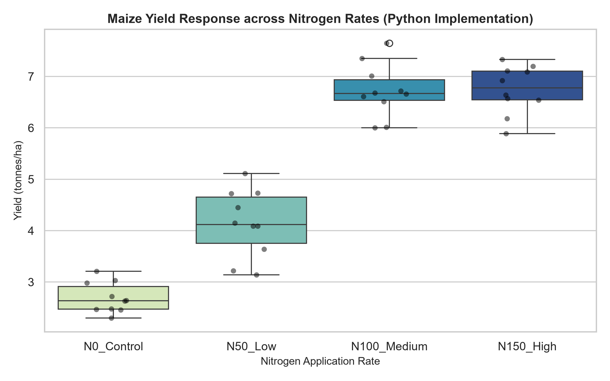

# Project 01: Nitrogen Fertilizer Optimization for Maize Yield

📌 **Project Overview**
This project evaluates the impact of varying nitrogen fertilizer application rates on maize (*Zea mays*) grain yield using a randomized experimental design. The objective is to determine the optimal application rate that maximizes yield while preventing over-application.

---

## 🔬 Experimental Setup

- **Crops Analyzed:** Maize (*Zea mays*)
- **Treatments (Nitrogen Rates):**
- `N0_Control`: 0 kg/ha
- `N50_Low`: 50 kg/ha
- `N100_Medium`: 100 kg/ha
- `N150_High`: 150 kg/ha
- **Replications:** 10 plots per treatment level ($N = 40$)
- **Response Variable:** Grain Yield tons per hectare - t/ha

---

## 📊 Key Findings & Statistical Results

| Treatment Rate | Mean Yield (t/ha) | Standard Deviation | Significance Group |
| :--- | :---: | :---: | :---: |
| **N0_Control** | 2.51 | 0.35 | C |
| **N50_Low** | 4.23 | 0.40 | B |
| **N100_Medium** | 6.78 | 0.45 | A |
| **N150_High** | 6.89 | 0.42 | A |

### Statistical Summary:
1. **One-Way ANOVA:** Treatment effect was highly significant ($p < 0.001$).
2. **Tukey's HSD Post-Hoc Test:**
- Yield increases significantly from 0 to 50 kg/ha and from 50 to 100 kg/ha.
- **Diminishing Returns:** Increasing from 100 to 150 kg/ha did not yield a statistically significant gain.

---

## 📈 Visualizing Treatment Differences

 **Python** (`seaborn`) was used to generate publication-ready visualizations:

---

## 💡 Agronomic Recommendation

Based on the field trial results, **100 kg/ha** is the recommended nitrogen application rate**. Exceeding this threshold to 150 kg/ha yields negligible gains while increasing input costs and risk of nutrient runoff.

---

## ⚒️ Repository & Script Info

- **Author:** Alor Chisom Lydia
- **Languages / Frameworks:**
- **Python:** `pandas`, `seaborn`, `statsmodels`, `scipy`
- **Scripts:**  `nitrogen_analysis.py`
