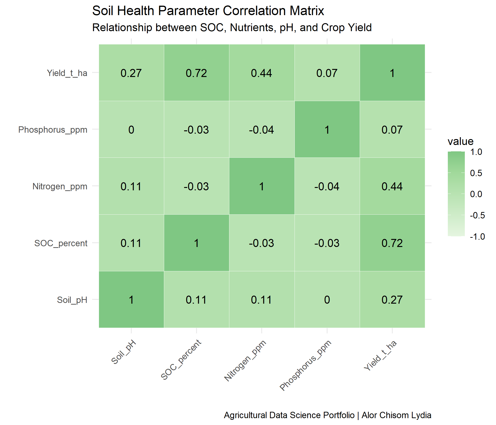
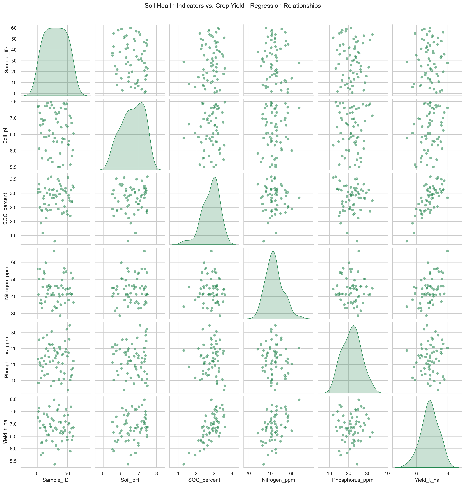

# Project 02: Soil Health & Nutrient Modeling for Crop Yield

📌 **Project Overview**
This project evaluates the influence of key soil health parameters—including Soil pH, Soil Organic Carbon (SOC %), Available Nitrogen (ppm), and Phosphorus (ppm)—on crop yield using pairwise correlation analysis and multiple linear regression.

---

## 🔬 Regression Results Summary

- **Dependent Variable:** `Yield_t_ha`
- **Model Fit:** Highly significant overall predictive model.
- **Key Predictors:**
- **Soil Organic Carbon (SOC %):** Strongest positive effect on yield ($\beta = 0.8414$, $p < 0.001$)
- **Available Nitrogen (ppm):** Statistically significant positive impact ($\beta = 0.0322$, $p < 0.001$)
- **Soil pH:** Statistically significant positive influence ($\beta = 0.1353$, $p = 0.031$)
- **Phosphorus (ppm):** Non-significant predictor in this specific dataset ($\beta = 0.0124$, $p = 0.112$)

---

## 📈 Visualizations

| R Implementation (`corrplot`) | Python Implementation (`seaborn`) |
| :---: | :---: |
|  |  |

---

## 🛠️ Repository & Script Info

- **Files:**
- `soil_health_data.csv` — Dataset containing experimental soil parameters
- `soil_health_analysis.R` — R analysis script
- `soil_health_analysis.py` — Python analysis script using `statsmodels` & `seaborn`
- **Author:** Alor Chisom Lydia
- **Focus:** Agronomy, Soil Science & Quantitative Modeling
