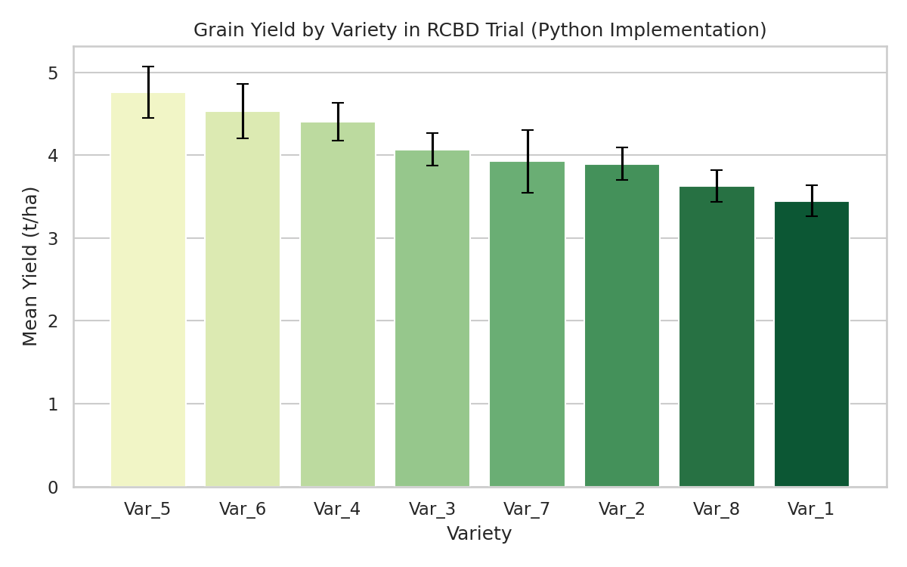

# Project 03: Plant Breeding Trial — Variety Comparison

📌 **Project Overview**
This project evaluates grain yield differences among 8 maize varieties tested in a Randomized Complete Block Design (RCBD). The objective is to identify which variety(ies) are statistically superior and should be advanced for further multi-location trials.

---

🔬 **Experimental Setup**

- **Crop Analyzed:** Maize (*Zea mays*)
- **Varieties Tested:** `Var_1` through `Var_8` (8 candidate varieties)
- **Design:** Randomized Complete Block Design (RCBD)
- **Blocks:** 3 (accounting for a known field fertility gradient)
- **Replications:** Each variety appears once per block (N = 24 plots)
- **Response Variable:** Grain Yield (tons per hectare — t/ha)

---

📊 **Key Findings & Statistical Results**

| Variety | Mean Yield (t/ha) | Standard Deviation |
|---|---|---|
| Var_5 | 4.76 | 0.54 |
| Var_6 | 4.53 | 0.57 |
| Var_4 | 4.40 | 0.40 |
| Var_3 | 4.07 | 0.34 |
| Var_7 | 3.93 | 0.66 |
| Var_2 | 3.90 | 0.34 |
| Var_8 | 3.63 | 0.33 |
| Var_1 | 3.45 | 0.32 |

**Statistical Summary:**
1. **Two-Way RCBD ANOVA:** Variety effect was significant (p < 0.05); block effect was included to account for the field gradient.
2. **Tukey's HSD Post-Hoc Test:** Identifies which varieties are statistically indistinguishable from the top performer(s) vs. significantly lower-yielding.
3. **Selection Insight:** Var_5 and Var_6 lead numerically; Tukey HSD determines whether they are statistically separable from Var_4, or whether all three form a top-performing group.

---

📈 **Visualizing Variety Differences**

Python (`seaborn`) was used to generate a ranked bar chart with standard error bars, showing mean yield per variety alongside the reliability of each estimate.

---

💡 **Breeding Recommendation**

Based on the RCBD trial results, the top-ranked varieties (Var_5, Var_6) are candidates for advancement. Final selection should combine this yield ranking with secondary traits (maturity duration, disease resistance) not captured in this single-trait analysis, and should be confirmed across additional locations/seasons before a variety is recommended broadly (guarding against genotype-by-environment interaction).

---

🛠️ **Repository & Script Info**

- **Author:** Alor Chisom Lydia
- **Languages / Libraries:** Python (`pandas`, `seaborn`, `statsmodels`, `scipy`)
- **Script:** `breeding_trial_analysis.py`
