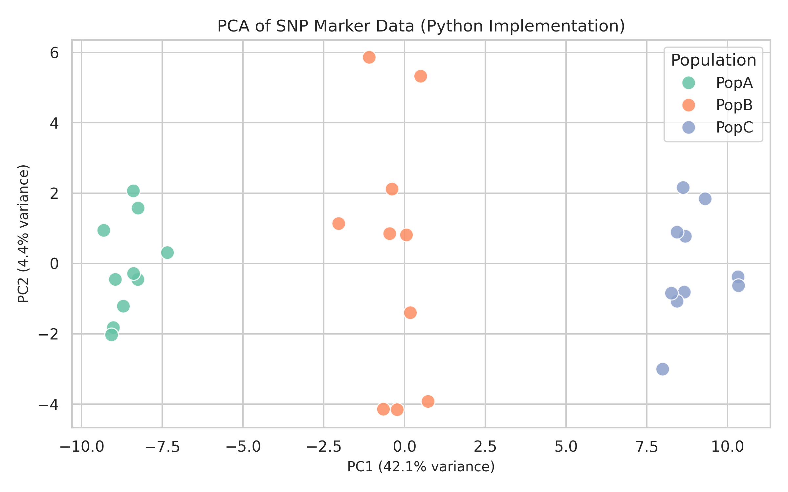
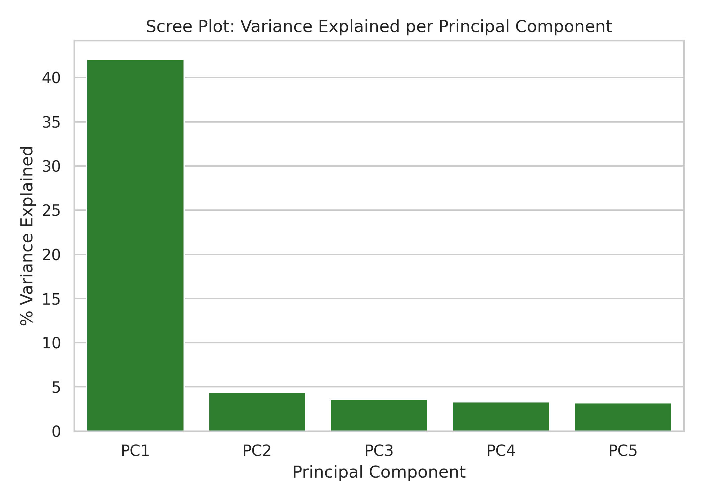

# Project 04: Introductory Genomics — PCA of SNP Marker Data

📌 **Project Overview**
This project applies Principal Component Analysis (PCA) to simulated SNP (Single Nucleotide Polymorphism) marker data to uncover population structure among breeding individuals. The objective is to demonstrate how genome-wide marker data can be reduced to a few interpretable dimensions revealing genetic relatedness — a foundational step toward genomic selection.

---

🧬 **Data Setup**

- **Individuals:** 30, across 3 simulated sub-populations (PopA, PopB, PopC)
- **Markers:** 200 SNPs, each coded 0/1/2 (count of alternate allele — homozygous reference, heterozygous, homozygous alternate)
- **Design Rationale:** Each sub-population was simulated with distinct allele frequency ranges, mimicking real genetically distinct breeding groups

---

📊 **Key Findings**

| Principal Component | Variance Explained |
|---|---|
| PC1 | 42.1% |
| PC2 | 4.4% |
| PC3 | 3.6% |
| PC4 | 3.3% |
| PC5 | 3.2% |

**Statistical Summary:**
1. **PC1 alone captures 42.1%** of total genetic variation — a strong signal, driven almost entirely by the underlying population structure built into the simulation.
2. **PCA scatterplot (PC1 vs PC2)** shows three visually distinct clusters corresponding to PopA, PopB, and PopC — confirming PCA successfully recovers known genetic groupings from marker data alone.
3. **Scree plot** shows a sharp drop-off after PC1, indicating most meaningful genetic variation is captured in a single dominant axis for this dataset.

---

📈 **Visualizing Genomic Data**

**Python** (`seaborn`/`scikit-learn`) was used to generate the PCA scatterplot and scree plot. 

---

💡 **Interpretation & Future Application**

The clear separation of populations in PCA space demonstrates how genomic marker data can classify genetic groups without any phenotypic (field trial) measurements — the conceptual foundation for genomic selection, where breeding values are predicted directly from marker data. In a real breeding program, this same PCA approach would be used to check for population stratification before running genomic prediction models, since unaccounted structure can bias marker-trait association results.

---

🛠️ **Repository & Script Info**

- **Author:** Alor Chisom Lydia
- **Languages / Frameworks:**
- **Python:** `pandas`, `scikit-learn` (`PCA`), `seaborn`, `matplotlib`
- **Script:** `genomic_pca_analysis.py`
